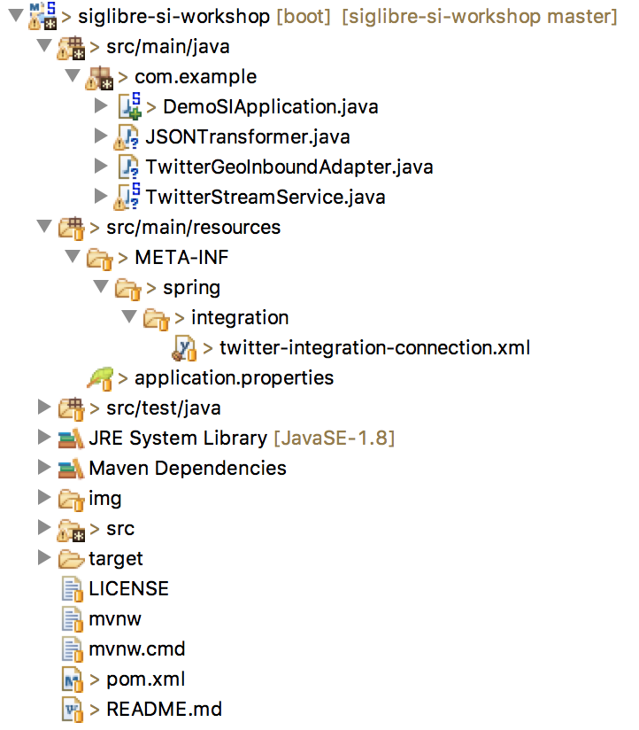
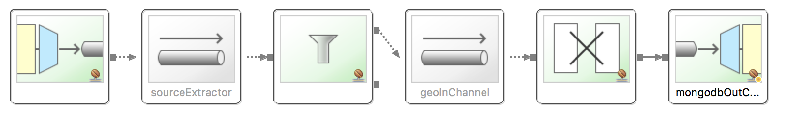

# Stream Data Ingestion Workshop

This is an exemple for the hands on session for SIGLibre.

We will create together a project in Spring integration framework to collect GEO data from twitter API and feed a MongoDB.


### Set Up your development environment

 - Open VirtualBOX and run the VM.
 - Run STS: 

	$> ./STS/sts-bundle/sts-3.7.3.RELEASE/STS

- Install Mongodb:

	$> sudo apt-get update
	$> sudo apt-get install mongodb

### Clone and develop the application

Clone this project in your terminal or Git Shell:

	$ git clone https://github.com/djkram/siglibre-si-workshop.git

Clone using STS:

	File > Import > Git > Projects from Git > Clone Uri

### Explore the the application

Open the siglibre-si-workshop on your STS


We Will work on:
- **pom.xml** : for manage dependencies
- **twitter-integration-connection.xml** : for spring integration configuration
- **application.properties** : for external variables
- **src/man/java > com.example** : to implement nedded classes

#### Technologies

On this whorkshop we will use:

- Maven
- Spring Boot
- Spring Integration
- TwitterAPI and Twitter4j
- MongoDB

## Hands On workshop Step by Step

### Understanding Spring Integration

Reference documentation of spring integration: [http://docs.spring.io/spring-integration/reference/htmlsingle/](http://docs.spring.io/spring-integration/reference/htmlsingle/)

- Read the [Part III](http://docs.spring.io/spring-integration/reference/htmlsingle/#spring-integration-introduction) for an overview.

- Read the [Part IV](http://docs.spring.io/spring-integration/reference/htmlsingle/#spring-integration-core-messaging) for a deep detail.

- Read the [Part V](http://docs.spring.io/spring-integration/reference/htmlsingle/#spring-integration-endpoints) to know the endpoints supported.


Open the configuration file: 

	src/main/resources/twitter-integration-connection.xml
	
This file is a configuratin XML to dessing the workflows on spring inegration. You can see the on XML format or as a graphical flow on the *integration-graph* tab.
	

This is the workflow currently:


And we will arrive on that:



### SetUp 1: Configuring the dependencies:

exploring the **pom.xml**

### SetUp 2: Create an App for Twitter API access

Go to: [https://apps.twitter.com/](https://apps.twitter.com/)


Complete the form:


Go To Tokens Tab:


Get your Keys:


Active your Tokens:


Get your Tokens:


	

### Step 1: Configure a Twitter Inbound 

#### Set UP your Twitter Api Credentials

Open the properties file: 

	src/main/resources/application.properties

Set your credentials:

	twitter.oauth.consumerKey=
	twitter.oauth.consumerSecret=
	twitter.oauth.accessToken=20428117-
	twitter.oauth.accessTokenSecret=
	
	twitter.search.query=
	
Run the Spring Boot Application:

	$> mvn clean spring-boot:run

Or

	Run As > Maven test
	Run As > Spring Boot App
	

**What appears in the console?** 

**Is possible to read the tweet?**
- to reead the tweet we will neeed a transformer.

Open the configuration file: 

	src/main/resources/twitter-integration-connection.xml
	
Add a transformer:

```xml
<int:transformer 
input-channel="sourceExtractor" 
output-channel="twitterOut" 
expression="payload.getText()"/>
```


Solution -> https://gist.github.com/djkram/99d5eefae5c0e35d4c0d2332366a5d21

### HOMEWORK

- Modify this project to store the tweets on a file

- File endpoint Reference (outbound): [http://docs.spring.io/spring-integration/reference/htmlsingle/#file-writing](http://docs.spring.io/spring-integration/reference/htmlsingle/#file-writing)

- configuration file example: [https://github.com/spring-projects/spring-integration-samples/blob/master/basic/file/src/main/resources/META-INF/spring/integration/fileCopyDemo-file.xml](https://github.com/spring-projects/spring-integration-samples/blob/master/basic/file/src/main/resources/META-INF/spring/integration/fileCopyDemo-file.xml)

- **Create a Git repository in GitHub, push your project and send the link to your teacher.**

- How to push a Git to GItHub: [https://help.github.com/articles/adding-an-existing-project-to-github-using-the-command-line/](https://help.github.com/articles/adding-an-existing-project-to-github-using-the-command-line/)