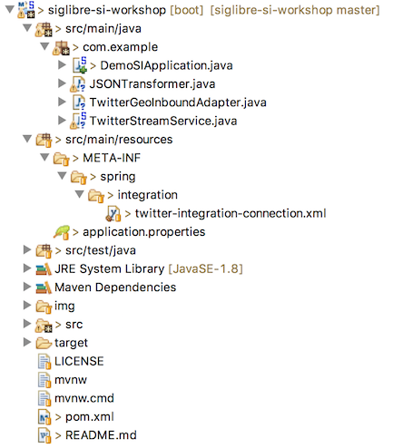

# Stream Data Ingestion Workshop

This is an exemple for the hands on session for SIGLibre.

We will create together a project in Spring integration framework to collect GEO data from twitter API and feed a MongoDB.


### Set Up your development environment

 - Open VirtualBOX and run the VM.
 - Run STS: 

	$> ./STS/sts-bundle/sts-3.7.3.RELEASE/STS

- Install Mongodb:

	$> sudo apt-get update
	$> sudo apt-get install mongodb

### Clone and develop the application

Clone this project in your terminal or Git Shell:

	$ git clone https://github.com/djkram/siglibre-si-workshop.git

Clone using STS:

	File > Import > Git > Projects from Git > Clone Uri

### Explore the the application

Open the siglibre-si-workshop on your STS



We Will work on:
- **pom.xml** : for manage dependencies
- **twitter-integration-connection.xml** : for spring integration configuration
- **application.properties** : for external variables
- **src/man/java > com.example** : to implement nedded classes

#### Technologies

On this whorkshop we will use:

- Maven
- Spring Boot
- Spring Integration
- TwitterAPI and Twitter4j
- MongoDB

## Hands On workshop Step by Step

### Understanding Spring Integration

Reference documentation of spring integration: [http://docs.spring.io/spring-integration/reference/htmlsingle/](http://docs.spring.io/spring-integration/reference/htmlsingle/)

- Read the [Part III](http://docs.spring.io/spring-integration/reference/htmlsingle/#spring-integration-introduction) for an overview.

- Read the [Part IV](http://docs.spring.io/spring-integration/reference/htmlsingle/#spring-integration-core-messaging) for a deep detail.

- Read the [Part V](http://docs.spring.io/spring-integration/reference/htmlsingle/#spring-integration-endpoints) to know the endpoints supported.


Open the configuration file: 

	src/main/resources/twitter-integration-connection.xml
	
This file is a configuratin XML to dessing the workflows on spring inegration. You can see the on XML format or as a graphical flow on the *integration-graph* tab.
	

This is the workflow currently:


And we will arrive on that:


### SetUp 1: Configuring the dependencies:

exploring the **pom.xml**

### SetUp 2: Create an App for Twitter API access

Go to: [https://apps.twitter.com/](https://apps.twitter.com/)


Complete the form:


Go To Tokens Tab:


Get your Keys:


Active your Tokens:


Get your Tokens:


	

### Step 1: Configure a Twitter Inbound 

#### Set UP your Twitter Api Credentials

Open the properties file: 

	src/main/resources/application.properties

Set your credentials:

	twitter.oauth.consumerKey=
	twitter.oauth.consumerSecret=
	twitter.oauth.accessToken=20428117-
	twitter.oauth.accessTokenSecret=
	
	twitter.search.query=
	
Run the Spring Boot Application:

	$> mvn clean spring-boot:run

Or

	Run As > Maven test
	Run As > Spring Boot App
	

**What appears in the console?** 

**Is possible to read the tweet?**
- to reead the tweet we will neeed a transformer.

Open the configuration file: 

	src/main/resources/twitter-integration-connection.xml
	
Add a transformer:

```xml
<int:transformer 
input-channel="CHANNEL-NAME???" 
output-channel="CHANNEL-NAME???" 
expression="payload.getText()"/>
```

and configure the names of the Channels

**Then Run It Again ;)**

Solution [be fair] -> https://gist.github.com/djkram/99d5eefae5c0e35d4c0d2332366a5d21

**But if I want to see more things about the Tweet?**

Explore the Object Tweet from the Spring social library:
[http://docs.spring.io/spring-social-twitter/docs/current/apidocs/org/springframework/social/twitter/api/Tweet.html](http://docs.spring.io/spring-social-twitter/docs/current/apidocs/org/springframework/social/twitter/api/Tweet.html)

Put Other "expresion" to see the User Location.


### Step 2: Create a new Inbound to get Geo data

Reference:
- [http://docs.spring.io/spring-integration/reference/html/messaging-channels-section.html](- http://docs.spring.io/spring-integration/reference/html/messaging-channels-section.html)

Disable the last Inbound: 

	search-inbound-channel-adapter

Add on XML:

```xml
<int:inbound-channel-adapter ref="twitterGeoInboundAdapter" method="receive" channel="sourceExtractor">
<int:poller fixed-rate="3000"/>
</int:inbound-channel-adapter>
	
<bean id="twitterGeoInboundAdapter" class="com.example.TwitterGeoInboundAdapter"></bean>
```

Now we have to implement the Class: TwitterGeoInboundAdapter

Open the Classes:
	
	TwitterStreamService.java
	TwitterGeoInboundAdapter.java

Complete the missing parts to create a new Twitter Inbound.

Solution [be fair] -> https://gist.github.com/djkram/552fd84110ade6ce97453f554ce34b03

### Step 3: Tranform to JSON

Add on XML:

```xml
<int:transformer 
input-channel="geoInChannel"
output-channel="mongodbOutChannel"
ref="jsonTransformer"
method="transformtoJSON"/>
	
<bean id="jsonTransformer" class="com.example.JSONTransformer"></bean>
```

Open the Class:

	JSONTransformer.java
	
Complete the missing parts to create a new Transformer.

Add on XML:
```xml
<int:filter 
input-channel="sourceExtractor" 
output-channel="geoInChannel"
expression="payload.getGeoLocation()!=null" />
```

**Then Run It Again ;)**

### Step 4: Mongo Ingestion

Add on XML:
```xml
<!-- MongoDB -->
<mongo:db-factory id="mongoDbFactory" 
host="${mongodb.host}"
dbname="${mongodb.database}" 
username="${mongodb.username}" 
password="${mongodb.password}" />	

<!-- Adding messages in MongoDB -->
<int-mongodb:outbound-channel-adapter
id="mongodbOutChannel" 
collection-name="${mongodb.collection}"
mongodb-factory="mongoDbFactory" />
```

Configure the Mongo credentials:

	# Mongo Credentials <PUT YOUR CREDENTIALS>
	mongodb.host=
	mongodb.username=
	mongodb.password=
	mongodb.database=siglibre
	mongodb.collection=tweets

**Then Run It Again ;)**

Check data loading in MongoDB
	
	$ mongo 
	> db.siglibre.tweets.count()

### Extra Task

- Modify this project tget data from files:

- Download this dataset (All Tweets in Catalunya on 2014 [6GB])
	
	wget https://s3-eu-west-1.amazonaws.com/eurecat-dataset-historic/twitter/eurecat-bts-dataset-twitter-2015.tar.gz

- File endpoint Reference (outbound): [http://docs.spring.io/spring-integration/reference/htmlsingle/#file-reading](http://docs.spring.io/spring-integration/reference/htmlsingle/#file-reading)
